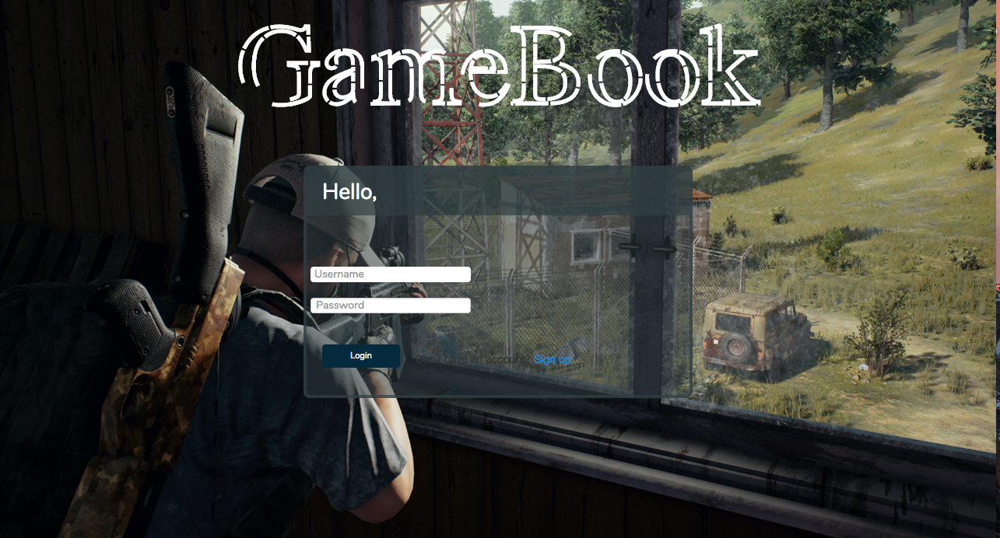
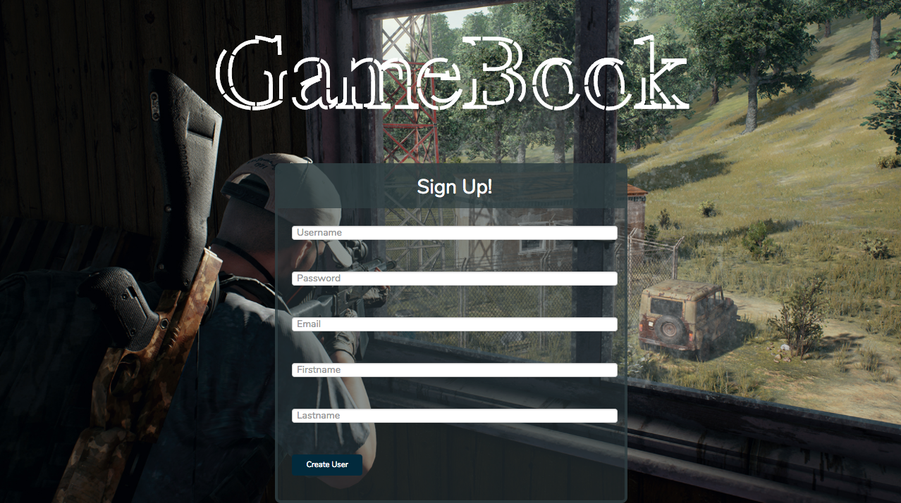
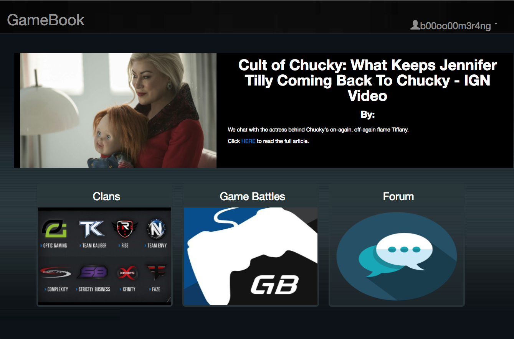
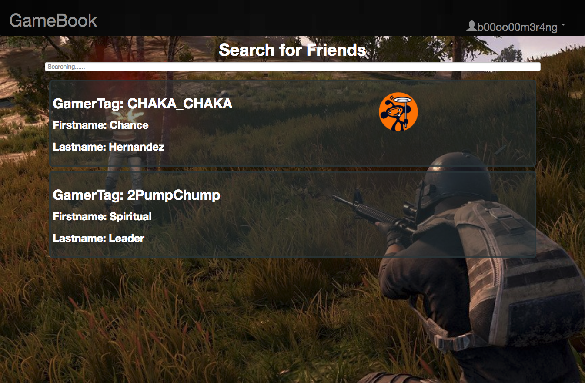
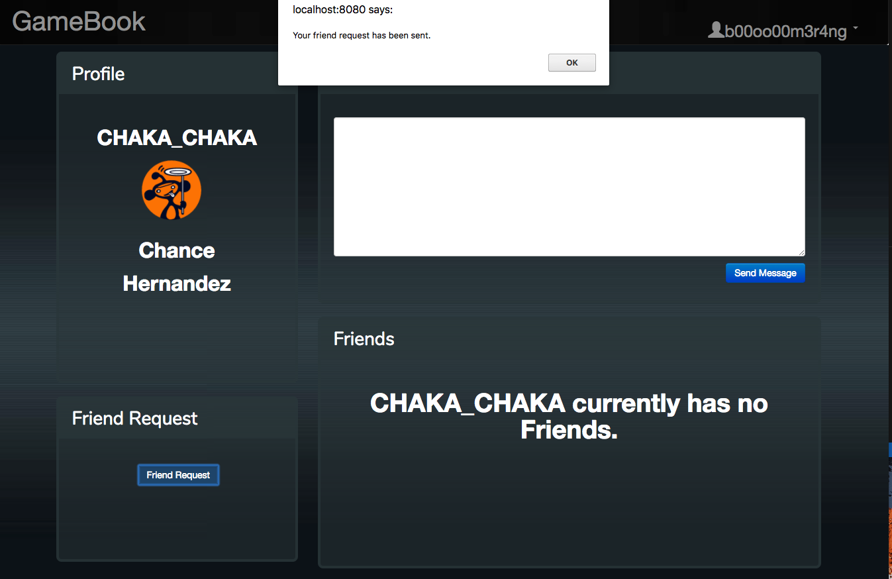
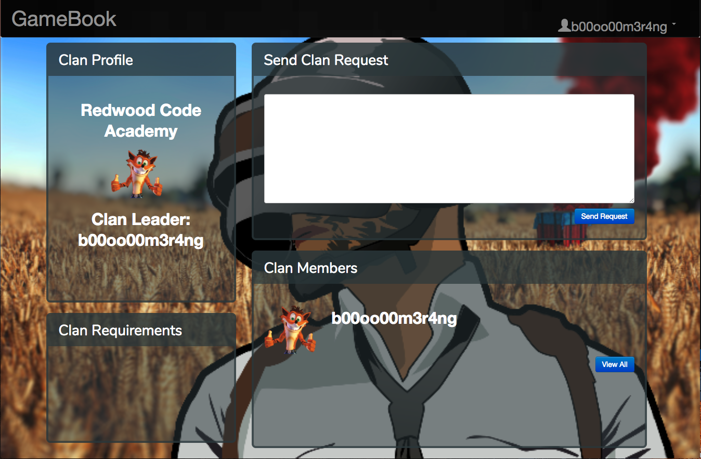
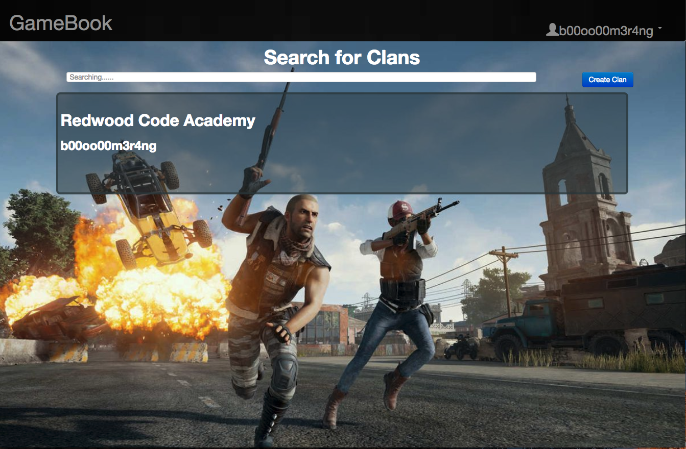

GameBook is a social media platform that brings together gamers from all around the world. Create a profile find your friends and build your own gaming empire.

Team: Shaneal Prasad and Chance Hernandez
Length: 1 week sprint

Technologies Used: HTML5, CSS3, Javascript, AngularJS, C#, ASP.Net MVC, and Entity Framework.